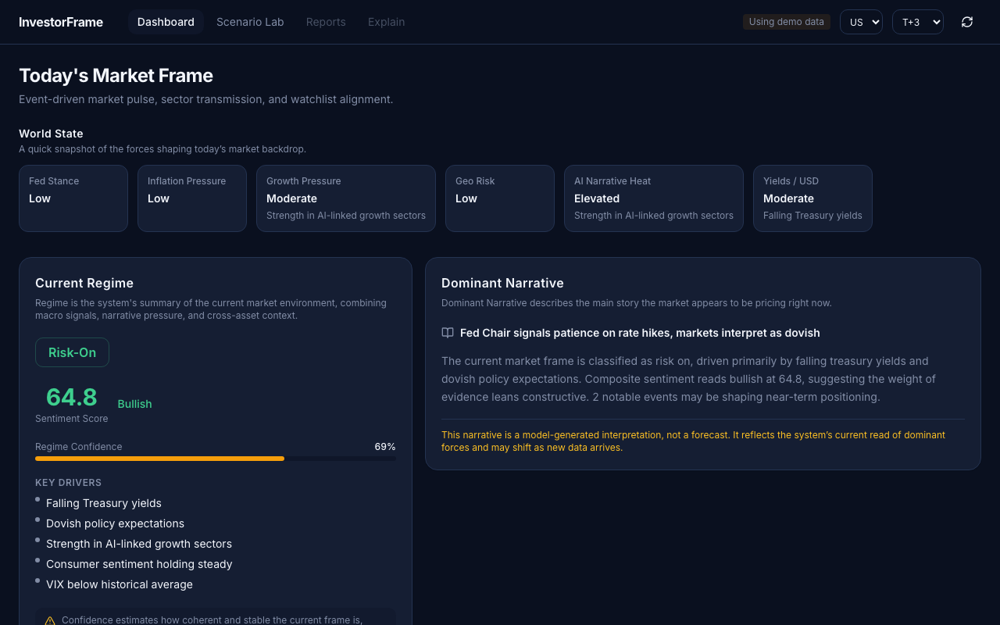
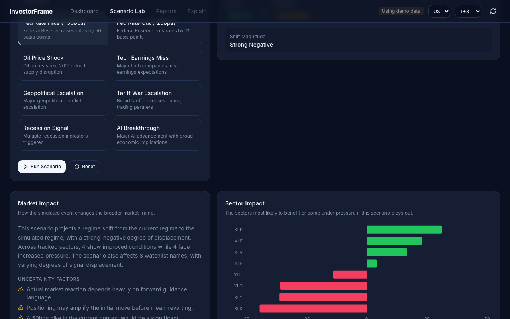

# InvestorFrame

> Event-driven market intelligence for macro signals, sector rotation, and watchlist analysis.

**InvestorFrame** is a research-first market intelligence platform that turns macro events, policy signals, geopolitical shocks, and market narratives into explainable market frames, sector transmission, and scenario-based watchlist insights.

Instead of starting with tickers, InvestorFrame starts with the world: what changed, what regime the market may be in, how that frame flows through sectors, and which names are aligned with or pressured by it.

InvestorFrame is built for interpretation, scenario analysis, and decision support — not certainty theater, and not automated trading.





---

## Why InvestorFrame

Most market tools begin with prices or tickers.

InvestorFrame begins with **events**.

That difference matters because markets are rarely driven by isolated symbols alone. They are shaped by:

- macro releases
- policy shifts
- geopolitical shocks
- yield and commodity moves
- narrative leadership
- positioning and uncertainty

InvestorFrame is designed to help answer four core questions:

1. **What changed in the world?**
2. **What market regime are we likely in now?**
3. **How is that regime transmitting through sectors?**
4. **Which names in a watchlist are aligned with or pressured by it?**

---

## Core Ideas

- **Event-Driven** — Start from macro signals, policy shifts, geopolitics, and narratives.
- **Regime-Aware** — Interpret signals in the context of the current market frame.
- **Explainable** — Every output includes drivers, risk flags, and uncertainty notes.
- **Scenario-Based** — Stress-test how the market frame may change if the world changes.
- **Research-First** — Built for investors, researchers, and market storytellers.

---

## What InvestorFrame Does

InvestorFrame is organized around three product surfaces:

### 1. Dashboard
See today's market frame at a glance:

- current regime
- sentiment score
- dominant narrative
- sector transmission
- watchlist alignment
- risk and uncertainty

### 2. Scenario Lab
Change one variable and observe how the frame may shift:

- hot CPI
- dovish Fed
- war escalation
- regulation relief
- stronger AI capex
- commodity shocks

### 3. Reports & Explain
Generate structured summaries and inspect why the system sees the market the way it does.

---

## Workflow

InvestorFrame follows a five-step workflow:

### 1. Event Ingestion
Capture market-moving signals such as macro releases, policy tone, geopolitical stress, yields, commodities, and narrative shifts.

### 2. Regime Framing
Translate noisy inputs into a structured market frame with confidence, contradictions, and uncertainty.

### 3. Sector Transmission
Identify which sectors are supported, pressured, or caught in mixed crosscurrents.

### 4. Watchlist Mapping
Evaluate how a curated watchlist fits the current market frame.

### 5. Scenario Simulation
Change one assumption, then observe how the frame, sectors, and watchlist may respond.

---

## Product Direction

InvestorFrame is **not** intended to be:

- a brokerage interface
- a hype-driven stock picker
- a black-box "AI alpha" product
- an automated trading engine

InvestorFrame **is** intended to be:

- an event-driven market research engine
- a regime-aware interpretation layer
- a sector transmission tool
- a scenario sandbox
- a structured explanation surface

---

## Example Use Cases

### Morning market framing
Understand the current regime before reacting to headlines.

### Event impact analysis
See how a new macro or geopolitical event may flow into sectors and watchlist names.

### Scenario testing
Explore how a hotter CPI print or a more dovish policy tone may reshape the market frame.

### Research and communication
Generate structured explanations for market views, reports, or content workflows.

---

## Example Output

### Market Frame

```json
{
  "date": "2026-03-09",
  "market": "US",
  "sentiment_label": "bullish",
  "sentiment_score": 64.8,
  "regime": "risk_on",
  "confidence": 0.69,
  "dominant_narrative": "Falling yields support growth leadership",
  "drivers": [
    "Falling Treasury yields",
    "Dovish policy expectations",
    "Strength in AI-linked growth sectors"
  ],
  "risk_flags": [
    "Macro event risk within 24h"
  ],
  "uncertainty_note": "Signal quality is moderate. Narrative reversals remain possible."
}
```

### Sector View

```json
{
  "date": "2026-03-09",
  "market": "US",
  "horizon": "T+3",
  "results": [
    {
      "sector": "Technology",
      "ticker_proxy": "XLK",
      "direction": "up",
      "score": 0.71,
      "confidence": 0.64,
      "drivers": [
        "AI narrative strength",
        "Yield relief"
      ],
      "risk_flags": [
        "Crowded positioning"
      ]
    },
    {
      "sector": "Energy",
      "ticker_proxy": "XLE",
      "direction": "up",
      "score": 0.68,
      "confidence": 0.66,
      "drivers": [
        "Oil strength",
        "Supply risk",
        "Geopolitical premium"
      ],
      "risk_flags": []
    }
  ]
}
```

### Watchlist Insight

```json
{
  "date": "2026-03-09",
  "market": "US",
  "horizon": "T+3",
  "results": [
    {
      "symbol": "NVDA",
      "name": "NVIDIA",
      "alignment": "tailwind",
      "trend_label": "mild_up",
      "confidence": 0.63,
      "sector": "Technology",
      "drivers": [
        "AI capex narrative",
        "Sector strength"
      ],
      "risk_flags": [
        "Valuation sensitivity"
      ]
    }
  ]
}
```

### Scenario Output

```json
{
  "scenario": "hot_cpi",
  "market": "US",
  "estimated_regime_shift": "inflation_scare",
  "market_effect": {
    "sentiment_delta": -0.18,
    "confidence": 0.58,
    "drivers": [
      "Higher inflation pressure",
      "Rate-sensitive growth under pressure"
    ]
  },
  "sector_impacts": {
    "positive": ["Energy", "Defensives"],
    "negative": ["Technology", "Consumer Discretionary"]
  },
  "watchlist_impacts": {
    "beneficiaries": ["XOM", "NEM"],
    "pressured": ["NVDA", "AMZN"],
    "mixed": ["JPM"]
  },
  "uncertainty_note": "Actual reaction depends on positioning and policy expectations."
}
```

---

## Repository Structure

```
.
├── .github/              # workflows and repo automation
├── api/                  # FastAPI routes and API entrypoints
├── cli/                  # command-line entrypoints
├── config/               # project configuration
├── dashboard/            # frontend or dashboard-related code
├── investorframe/        # core package logic
├── output/               # generated outputs or local artifacts
├── tests/                # tests
├── .env.example
├── Dockerfile
├── Makefile
├── pyproject.toml
└── README.md
```

As the project matures, code organization should increasingly converge around clearer package boundaries and stronger docs.

---

## Quick Start

### 1. Clone the repository

```bash
git clone https://github.com/kingsmangithub/InvestorFrame.git
cd InvestorFrame
```

### 2. Create an environment file

```bash
cp .env.example .env
```

### 3. Install dependencies

Use the project's preferred install flow documented in the repository. If a Makefile or project scripts are available, prefer those.

Typical patterns may include:

```bash
make setup
make dev
```

or:

```bash
pip install -e .
```

### 4. Run the project

Depending on the current surface you want to use, run:

- API
- dashboard
- CLI
- tests

For example:

```bash
make api
make dashboard
make test
```

If the command set differs in the current repo version, follow the latest project scripts and docs.

---

## Design Principles

InvestorFrame is built around five principles:

### Event-first
Start from what changed in the world, not just what moved on a chart.

### Regime-aware
Interpret signals in context. The same event can imply different outcomes under different market conditions.

### Explainable
Outputs should expose drivers, confidence, risk flags, and uncertainty.

### Probabilistic
InvestorFrame frames possible market structure. It does not promise deterministic outcomes.

### Research-first
The goal is clearer interpretation and better reasoning, not hype or false precision.

---

## What Makes InvestorFrame Different

### Event-first, not ticker-first
Most tools ask: "What is this stock doing?" InvestorFrame asks: "What changed in the environment, and how is that flowing through the market?"

### Regime-aware, not context-blind
A rate move, inflation surprise, or geopolitical shock does not mean the same thing in every market state.

### Explainable, not black-box
InvestorFrame is designed to show its logic, not just its outputs.

### Scenario-based, not static
The system is intended to help users test changes in the world, not just describe the present.

---

## Project Status

InvestorFrame is in an early public stage.

Current priorities include:

- product framing
- repo hardening
- docs quality
- dashboard and scenario UX
- example outputs
- trust and explainability layers

This means the project is already useful as a concept, scaffold, and evolving workflow, but it is still being actively refined.

---

## Roadmap

**Short-term priorities:**

- improve repo hygiene and metadata
- strengthen docs and examples
- polish landing page and brand consistency
- ship Dashboard MVP
- ship Scenario Lab MVP

**Medium-term priorities:**

- report surfaces
- explain layer
- stronger scenario workflows
- example case library
- historical frame tracking

**Long-term direction:**

- hosted demo
- docs site
- stronger trust surfaces
- richer scenario comparison
- better historical context and memory

For more detail, see:

- [docs/architecture.md](docs/architecture.md)
- [docs/roadmap.md](docs/roadmap.md)

---

## Contributing

Contributions are welcome, especially in areas such as:

- docs
- examples
- UI polish
- API consistency
- tests
- scenario templates
- repo hygiene
- explainability improvements

Please read:

- [CONTRIBUTING.md](CONTRIBUTING.md)
- [SECURITY.md](SECURITY.md)

before opening a pull request.

---

## Security

Please do not report security issues through public issues if they involve secrets, credentials, or sensitive configuration details.

See [SECURITY.md](SECURITY.md) for guidance.

---

## Disclaimer

InvestorFrame is provided for **research, education, and experimentation only**.

It does **not** constitute investment advice, trading advice, or any guarantee of results. All outputs are probabilistic and subject to model risk, data limitations, regime shifts, and event-driven reversals.

Users are responsible for their own decisions, due diligence, and compliance with applicable laws and data-provider terms.

---

## License

See [LICENSE](LICENSE).
